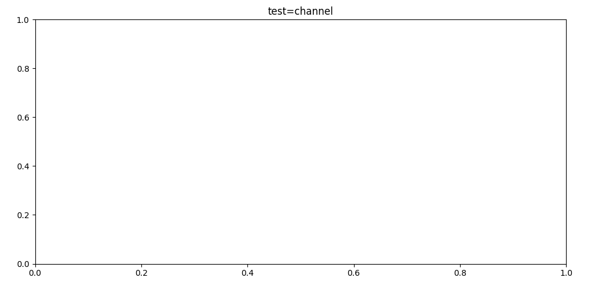
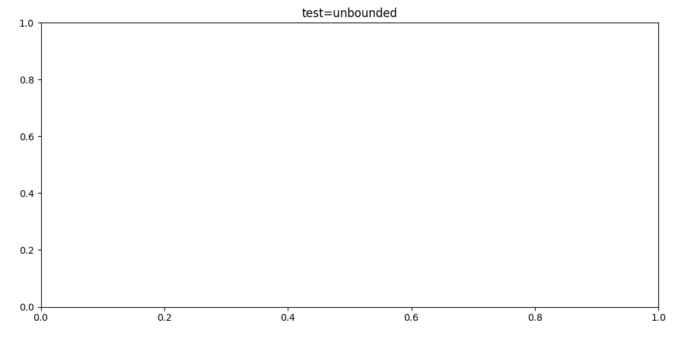
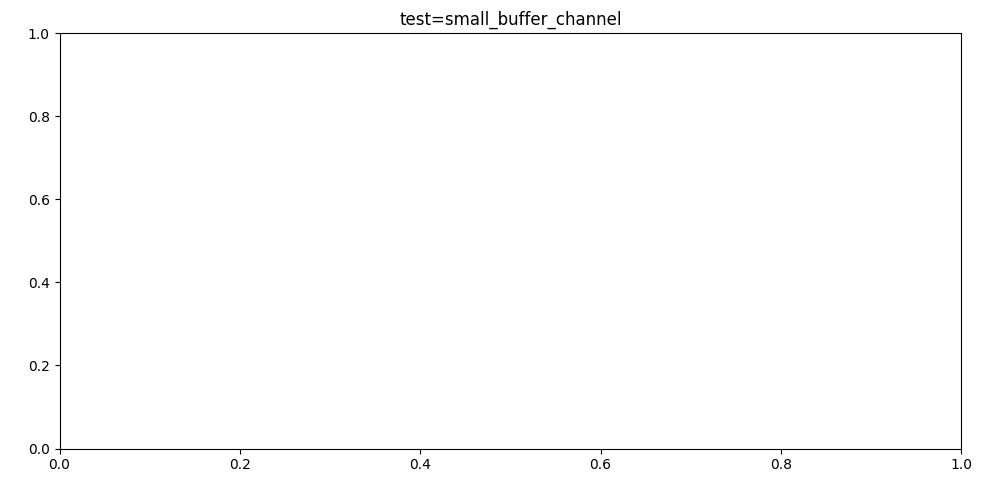
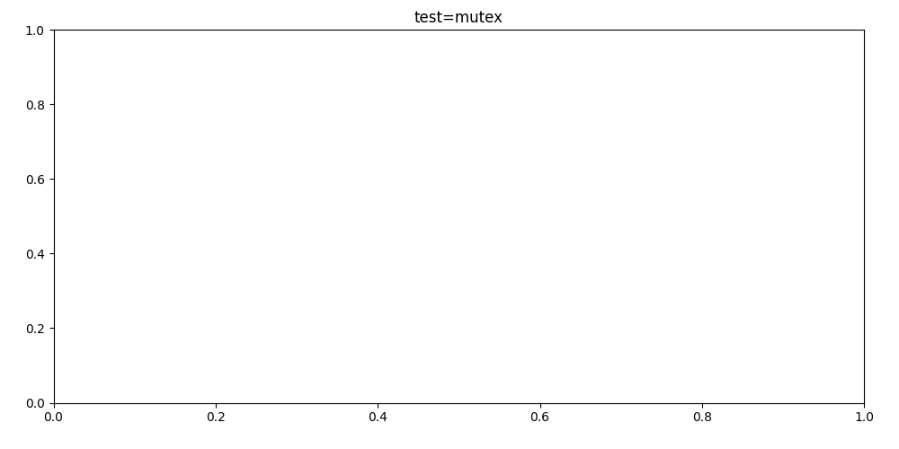
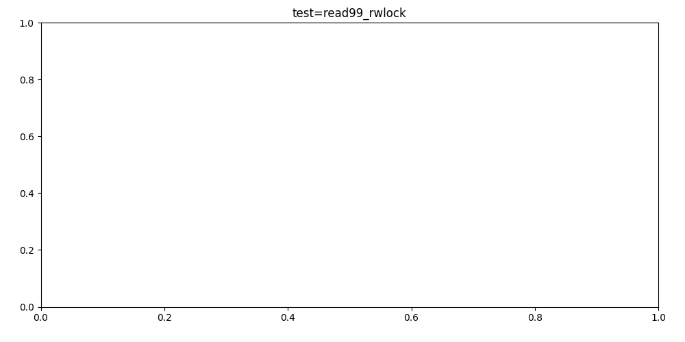

# Overview
Different concurrency primitives allow access to shared resources in various ways. In the context of async Rust, tokio-rs and its corresponding scheduler: when a task (green thread) is suspended waiting for access, each primitive has a distinct method to determine task readiness for said resource. Therefore, this affects when the task is woken up, added to the runnable queue, and eventually executed by a worker thread (OS thread). As a result, this coordination between the concurrency primitive and the scheduler drive resource-access latency.

Therefore, we are looking to understand:
- Given 16 tokio worker threads (OS threads),
- Given 10,000 tasks (green threads) all requesting to access a shared resource,
- When using various concurrency primitives,
- How long does it take the system to access the requested resource?

**In other words, under high contention, how does resource-access latency vary across concurrency primitives?**

This idea is important, as synchronization overhead can drive latency just as much as resource contention when understanding throughput.

### Invariants:
1. Little to no work is actually performed when obtaining access to shared memory.
    - This is done to ensure latency variance is due to concurrency primitives affecting task readiness, scheduler behavior, and subsequently observed latency.
    - Actor (channel) responds with `()` as soon as the request is received
    - Mutex / RwLock and Semaphore all `drop(..)` their locks/permits as soon as they obtain them
    - The latency of these operations are considered negligible
2. All tokio concurrency primitives are FIFO for their waiters but not for the scheduler.
    - Tokio's scheduler optimizes work and reorders the queue of runnable tasks.
    - For mutexes, even though the Nth task may be woken up, they may get scheduled later in favor of other tasks [not accessing the mutex] therefore driving *up* latency.
    - For channels, even though the receiver may handle the Nth task later than the N-1th task, the scheduler may execute the Nth task first, seeing the response earlier, driving *down* latency.
    - In our case, there are no other tasks to reorder in favor of more "meaningful work". Therefore, we shouldn't see this issue but if it did, ultimately, it contributes to the observed latency when using tokio.

# Channel

### Actor Model
As the channel is the odd one out of the bunch and is more of an atomic queue rather than a lock, for these tests the [**actor model**](https://en.wikipedia.org/wiki/Actor_model) is used. The actor model is a common alternative to lock-based synchronization. Therefore, it is especially important to benchmark as the trade-offs may be more favorable compared to a mutex.

TL;DR the actor model uses a dedicated thread that owns its own state that outsiders make requests to read or update. Therefore, creating deterministic ordering and thread-safe mutations at the cost of memory and increased boilerplate. All functionality that would normally be exposed by simply defining a function as the public API must also be modeled as a message object and mapped to said function in the actor thread. All memory that would be available to read by a pointer or reference must now be copied.

### 
The standard `mpsc::channel` is bounded to a buffer size that blocks senders until there is room to enqueue their message/request. This backpressure is important in preventing memory exhaustion by ensuring that channels are constrained to their memory allocation and and pushing producers to match a pace that consumers can handle. *It's better to slow down / reject requests that let them build up and crash the system for everyone.*

### Test Setup
To understand latency when using actor model implemented with `mpsc::channel`, 3 different tests were ran:
1. Bounded channel, buffer size = n = 10,000
2. Bounded channel, buffer size = worker_threads = 16
3. Unbounded channel, buffer size is infinite, bounded merely by physical memory

- Test 1 will show standard operation of a bounded channel. No request will ever block.
- Test 2 will block heavily as it can only hold 16 of the 10,000 requests at a time: trading lower memory usage for higher latency
- Test 3 will never block similar to Test 1. Under the hood, the two both use the `chan::channel(..)` construct ([source/bounded](https://github.com/tokio-rs/tokio/blob/master/tokio/src/sync/mpsc/bounded.rs#L165-L170), [source/unbounded](https://github.com/tokio-rs/tokio/blob/master/tokio/src/sync/mpsc/unbounded.rs#L95-L102)). However, I would suppose that the CPU would make better use of spatial locality with a fixed bounded buffer similar to how arrays normally outperform linked-lists although sequential traversal is both $O(n)$. Furthermore, the overhead bookkeeping to manage the bounded channel's internals may skew performance when compared 1:1.

For each test, 10,000 tokio tasks all send their request (modeled as a `oneshot::Sender` for the actor to reply on) and measure their own felt latency starting from sending their request to the actor and ending after receiving their response on their `oneshot::Receiver`. Therefore, this test also includes scheduler latency as a response may be available but the scheduler may not immediately schedule the receiving task to stop its timer (driving up latency). However, this is a product of the system and ultimately the latency each task feels when attempting to access a shared resource under high contention.

| Bounded Channel @ buffer_size=10_000 | Unbounded Channel @ buffer_size=inf. | Bounded Channel @ buffer_size=16 |
| - | - | - |
|  |  |  |

# Mutex

# RwLock

| RwLock @ 50% Read 50% Write | RwLock @ 0% Read 100% Write | RwLock @ 100% Read 0% Write | RwLock @ 99% Read 1% Write |
| - | - | - | - |
|  |  |  |  | 

# Semaphore

| Semaphore @ permits=1 | Semaphore @ permits=n=10_000 | 
| - | - |
|  |  |